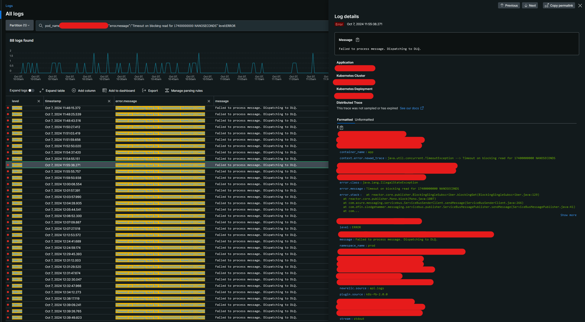

# Reproducible ASB "Timeout on blocking read" errors

## Problem 
From time to tine "Timeout on blocking read" errors will be encountered when publishing to ASB. 
In most cases the failure is transient, however, in some rare cases the error will persist:



## Reproducing the error
The error can be reproduced in the following scenario:
- A simple app that periodically published and reads from and ASB queue is created.
- 10 instances of the app are run in parallel via docker-compose.
- Every 60 seconds the containers are restarted.
- After running the example for some time the timeout errors can be observed.

Files `logs_*.txt` contain exemplary logs once the error is encountered. 
Sometimes the errors appear instantly, sometimes after a few or several dozen minutes.

The errors were reproduced on **more than one computer** (Windows, MacOS) and on **more than one network**.
Example of the error:
```
[pool-8-thread-1] ERROR org.example.Main - Failed to send message
java.lang.IllegalStateException: Timeout on blocking read for 17400000000 NANOSECONDS
	at reactor.core.publisher.BlockingSingleSubscriber.blockingGet(BlockingSingleSubscriber.java:124)
	at reactor.core.publisher.Mono.block(Mono.java:1766)
	at com.azure.messaging.servicebus.ServiceBusSenderClient.sendMessage(ServiceBusSenderClient.java:266)
	at org.example.Main.lambda$schedulePublishing$3(Main.java:84)
	at java.base/java.util.concurrent.Executors$RunnableAdapter.call(Executors.java:539)
	at java.base/java.util.concurrent.FutureTask.runAndReset(FutureTask.java:305)
	at java.base/java.util.concurrent.ScheduledThreadPoolExecutor$ScheduledFutureTask.run(ScheduledThreadPoolExecutor.java:305)
	at java.base/java.util.concurrent.ThreadPoolExecutor.runWorker(ThreadPoolExecutor.java:1136)
	at java.base/java.util.concurrent.ThreadPoolExecutor$Worker.run(ThreadPoolExecutor.java:635)
	at java.base/java.lang.Thread.run(Thread.java:840)
```

## Running the example
1. Clone the repository
2. Create a file `.env` with the following content:
```
# Your connection string to the ASB namespace
CONNECTION_STRING=...
# The name of the queue to be used
QUEUE_NAME=...

# Default values work well, but can be customized if needed
# Whether V2 stack of the SDK. Should be used. Errors reproducible with both V1 and V2.
V2_ENABLED=false
# Probability to log debug information on publish. Higher percentage = more spam in the logs.
SEND_LOG_PROBABILITY=0.05
# Probability to log debug information on receive. Higher percentage = more spam in the logs.
RECEIVE_LOG_PROBABILITY=0
# Time to live of a container before a restart.
TTL_MINUTES=1
```
3. Build the app: `./gradlew build`
4. Build a docker image. `docker build . -t asb-debug:latest`
5. Run the docker-compose: `docker-compose up --force-recreate --no-color |& tee logs.txt`
6. Observe the logs. The error should appear after some time, can range from a few minutes to a few dozen minutes.
8. To stop the containers, press `Ctrl+C` and run `docker-compose down`
9. Logs will be saved in file `logs.txt`